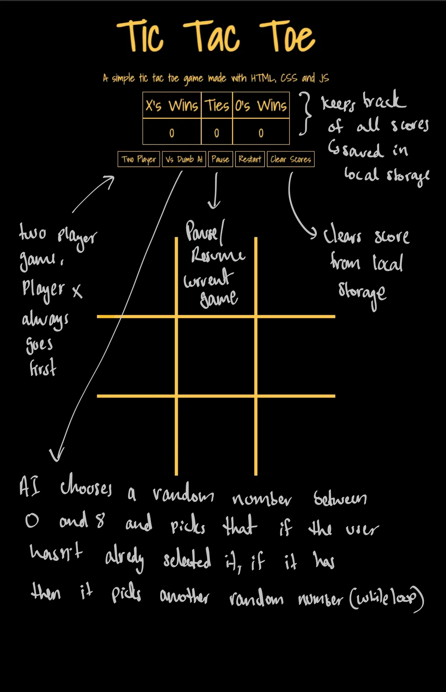

# tic-tac-toe
A simple tic-tac-toe game made using Javascript, Html and CSS

## Game Layout
<em>[Check out the planning/psuedo code here -plan.pdf](./images)</em>

## Logic behind the game
Each square of the baord has a data attribute. When a player clicks on a square, that data attribute is retrived and pushed into an array. Once the array reaches a minimum length of 3, it checks that array against a possible list of winning combinations which is stored in a nested array. the values are compared using the array.every function. this way it will only return true if all the values in the winning combination is present in the player array regardless of order.

The game checks for a draw by checking everytime if the length of both players arrays add up to 9, if so then it means all the boxes have been filled without a winner being declared and so it is a draw.

## Logic behind the AI
The AI works by choosing a random number between 0 and 8 and then it checks if that square has already been selected if so it goes back and selects another random number and keeps going till the selected number is not filled.

Since it is random, it's no challenge to the player to win. This random AI was supposed to be temporary/starting off point but ended up in the final version due to time constraints. I did get a more intelligent AI to work but it only knew how to block the player, and not win itself so it always forced a draw which made it impossible for the player to win hence runing the user experince. So I left the random AI in the project and asked users to try and let it win since it dosen't know how to win/lose. This made it more fun as it is not easy to let it win.

## Future Improvements
- I would absolutely like to add more animations, make the messages ease in and out.
- When I get time, I would like to implement a more intelligent AI and add difficulty levels. 
- Include some subtle background music.
- Possbily look into adding multiple squares.

